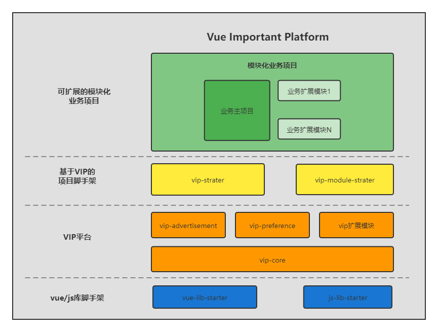

# Vue Important Platform

基于Vue和前端最佳实践设计的快速开发平台。

## 平台组件及版本

* [vip-appstore (0.1.0-alpha.1)](vip-appstore/README.md)：应用市场，配套ubp-appstore使用
* [vip-atmosphere (0.1.0)](vip-atmosphere/README.md)：为应用添加氛围效果，用于庆祝节日、纪念重大事件等场景
* [vip-audit-baidu (0.2.0)](vip-audit-baidu/README.md)：百度统计，配套ubp-audit-baidu使用
* [vip-audit-log (0.5.0)](vip-audit-log/README.md)：日志审计，配套ubp-audit-log使用
* [vip-banner (0.1.0)](vip-banner/README.md)：用于在console中输出品牌信息
* [vip-core (1.0.0)](vip-core/README.md)：基于Vue和ElementUI实现的前端开发平台VIP内核
* [vip-device-adapter (0.1.0)](vip-device-adapter/README.md)：设备适配器，可根据当前访问设备跳转到适配的地址
* [vip-dictionary (0.2.0)](vip-dictionary/README.md)：通用字典配置，配套ubp-dictionary使用
* [vip-iam (0.8.0)](vip-iam/README.md)：身份标识和访问控制，配套ubp-iam使用，为其提供管理界面
* [vip-icon (0.3.0)](vip-icon/README.md)：提供各类型图片图标显示组件
* [vip-notice-element (0.2.1)](vip-notice-element/README.md)：基于ElementUI实现的通知管理器
* [vip-preference (0.4.0)](vip-preference/README.md)：用户偏好设置组件，配套ubp-preference使用
* [vip-theme-vab (0.4.1)](vip-theme-vab/README.md)：基于vue-admin-better的主题样式、布局以及配置